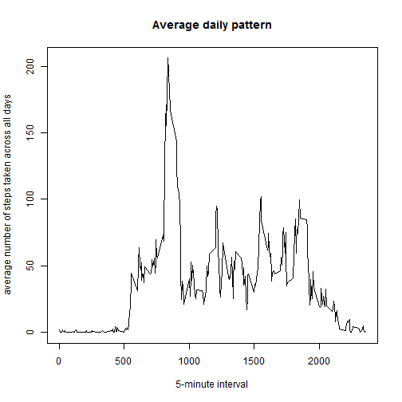

## Loading and preprocessing the data
<!--
Show any code that is needed to

1. Load the data (i.e. `read.csv()`)

2. Process/transform the data (if necessary) into a format suitable
   for your analysis

-->
We'll first load the 'dplyr' package because we'll do a bit of summarizing.


```r
library('dplyr')
```

Later we'll work on dates so we'll load the 'timeDate' package (e.g. the built-in weekdays() function depends on the Locale so we'd rather not use that):


```r
library('timeDate')
```

And we'll use the 'lattice' package to do a panel plot.


```r
library('lattice')
```

We load the data through read.csv and use a connection created by 'unz':


```r
stepsInt <- read.csv(unz("activity.zip", "activity.csv"))
```

In the next section we'll be investigating the number of steps taken per day, so let's do a bit of processing to summarize data per day.


```r
stepsperday <- stepsInt %>%
        group_by(date) %>%
        summarize(steps = sum(steps))
```

## What is mean total number of steps taken per day?
<!--
For this part of the assignment, you can ignore the missing values in the dataset.

Make a histogram of the total number of steps taken each day

Calculate and report the mean and median total number of steps taken per day
-->

In this part we ignore the missing values in the dataset. We create a histogram of the total number of steps taken each day using the 'hist' function.
 

```r
hist(stepsperday$steps, xlab = "Steps per day", ylab = "Number of days", main = "Histogram of the total number of steps taken each day")
```

 

We calculate the mean of the total number of steps taken by day:


```r
mean(stepsperday$steps, na.rm = T)
```

```
## [1] 10766.19
```

and the median of the total number of steps taken by day:


```r
median(stepsperday$steps, na.rm = T)
```

```
## [1] 10765
```

## What is the average daily activity pattern?
<!--

1. Make a time series plot (i.e. `type = "l"`) of the 5-minute
   interval (x-axis) and the average number of steps taken, averaged
   across all days (y-axis)

2. Which 5-minute interval, on average across all the days in the
   dataset, contains the maximum number of steps?

-->

In order to gauge the activity at different times during the day, we'll calculate the average number of steps taken in each 5-minute interval as an average across all days.


```r
stepsperint <- stepsInt %>%
        group_by(interval) %>%
        summarize(steps = mean(steps, na.rm = T))
```

And let's plot it to get an idea of the activity during the day:


```r
plot(x = stepsperint$interval, y = stepsperint$steps, type = "l", xlab = "5-minute interval", ylab = "average number of steps taken across all days", main = "Average daily pattern")
```

 

The interval with the maximum number of steps taken on average across all days in the dataset is:


```r
stepsperint[order(-stepsperint$steps),]$interval[[1]]        
```

```
## [1] 835
```

## Imputing missing values
<!--

Note that there are a number of days/intervals where there are missing
values (coded as NA). The presence of missing days may introduce
bias into some calculations or summaries of the data.

1. Calculate and report the total number of missing values in the
   dataset (i.e. the total number of rows with NA's)

2. Devise a strategy for filling in all of the missing values in the
   dataset. The strategy does not need to be sophisticated. For
   example, you could use the mean/median for that day, or the mean
   for that 5-minute interval, etc.

3. Create a new dataset that is equal to the original dataset but with
   the missing data filled in.

4. Make a histogram of the total number of steps taken each day and
   Calculate and report the mean and median total number of steps
   taken per day. Do these values differ from the estimates from the
   first part of the assignment? What is the impact of imputing
   missing data on the estimates of the total daily number of steps?

-->
We are interested in missing values and specifically the number of rows with NA's. We first notice that the 'date' and the 'interval' columns are never null (using the fact that in sums, true (T) counts as 1 and false (F) as 0):


```r
sum(is.na(stepsInt$date) + is.na(stepsInt$interval))
```

```
## [1] 0
```

So there are only missing values in the 'steps' column. The number of missing values in the data set can therefore be calculated as:


```r
sum(is.na(stepsInt$steps))
```

```
## [1] 2304
```

We'll now replace NA values in the 'steps' by the mean for that 5-minute interval. We can take the values from the 'stepsperint' table.


```r
stepsWONA <- within(stepsInt, steps <- ifelse(is.na(steps), stepsperint$steps, steps))
```

In order to compare the data with previous calculations where we ignored NA's we'll do the same processing as before:


```r
stepsperdayWONA <- stepsWONA %>%
        group_by(date) %>%
        summarize(steps = sum(steps))
```


```r
hist(stepsperdayWONA$steps, xlab = "Steps per day", ylab = "Number of days", main = "Histogram of the total number of steps taken each day (imputed)")
```

 

We calculate the mean of the total number of steps taken by day:


```r
mean(stepsperdayWONA$steps)
```

```
## [1] 10766.19
```

and the median of the total number of steps taken by day:


```r
median(stepsperdayWONA$steps)
```

```
## [1] 10766.19
```

So we get the same mean as before and the median becomes this mean. This can be explained if the NA's "fill out" entire days:


```r
nasperday <- stepsInt %>%
        group_by(date) %>%
        summarize(nas = sum(is.na(steps)))
unique(sort(nasperday$nas))
```

```
## [1]   0 288
```

So indeed: Either a day has no NA's or it is made up entirely of NA's.

## Are there differences in activity patterns between weekdays and weekends?

<!--
For this part the weekdays() function may be of some help here. Use
the dataset with the filled-in missing values for this part.

1. Create a new factor variable in the dataset with two levels weekday
   and weekend indicating whether a given date is a weekday or weekend
   day.

2. Make a panel plot containing a time series plot (i.e. type = l) of
   the 5-minute interval (x-axis) and the average number of steps
   taken, averaged across all weekday days or weekend days
   (y-axis). The plot should look something like the following, which
   was created using simulated data:
   
sampleplot

Your plot will look different from the one above because you will
be using the activity monitor data. Note that the above plot was made
using the lattice system but you can make the same version of the plot
using any plotting system you choose.
-->

Now we'll examine if there is differences in activity patterns between weekdays and weekends. So we add a factor to the dataset. The factor indicates whether the observation is from a weekday or weekend.


```r
stepsInt$weekpart <- factor(ifelse(isWeekday(as.Date(stepsInt$date)), "weekday", "weekend"), levels = c("weekday", "weekend"))
```

And we summarize across the weekdays and intervals:


```r
stepsperintWP <- stepsInt %>%
        group_by(interval, weekpart) %>%
        summarize(steps = mean(steps, na.rm = T))
xyplot(stepsperintWP$steps ~ stepsperintWP$interval|stepsperintWP$weekpart, type="l", xlab = "5-minute interval", ylab = "average number of steps taken across all days in period", main = "Average pattern according to weekday/weekend")
```

 
